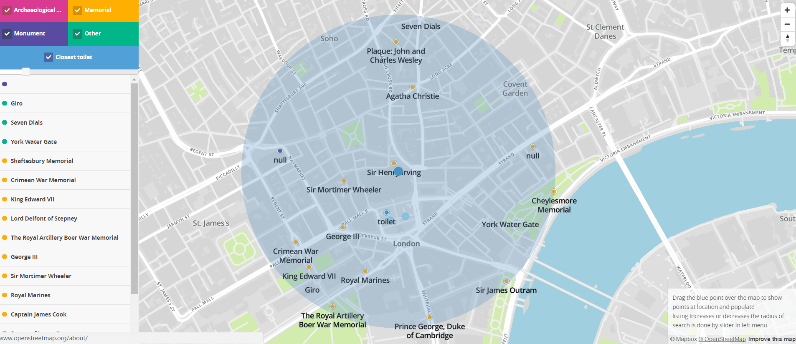

# Overview

Purpose of this application is to show historical monuments,remains of London on map. Most important features are:
- search by proximity to my current location
- search by historical places categories(Archeological site, monuments, memorials and rest )
- search for closest restroom
- showing list of found points
- ability to increase or decrease radius of searching 

This is it in action:



The application consist two main parts, which are frontend web application and backand python application. Python script is also communicating with PostfreSQL database.
he application has 2 separate parts, the client which is a [frontend web application](#frontend) using mapbox API and mapbox-gl.js and the [backend application](#backend) written in [Rails](http://rubyonrails.org/), backed by PostGIS. The frontend application communicates with backend using a [REST API](#api).

# Frontend

The frontend application is a static HTML page (`index.html`), which shows a mapbox.js widget. It is displaying hotels, which are mostly in cities, thus the map style is based on the Emerald style. I modified the style to better highlight main sightseeing points, restaurants and bus stops, since they are all important when selecting a hotel. I also highlighted rails tracks to assist in finding a quiet location.

All relevant frontend code is in `application.js` which is referenced from `index.html`. The frontend code is very simple, its only responsibilities are:
- detecting user's location, using the standard [web location API](https://developer.mozilla.org/en-US/docs/Web/API/Geolocation/Using_geolocation)
- displaying the sidebar panel with hotel list and filtering controls, driving the user interaction and calling the appropriate backend APIs
- displaying geo features by overlaying the map with a geojson layer, the geojson is provided directly by backend APIs

# Backend

The backend application is written in Ruby on Rails and is responsible for querying geo data, formatting the geojson and data for the sidebar panel.

## Data

Data source is originated from OpenStreetMap. I downloaded an .osm file covering the area of greater london (around 43MB) and imported it using the `osm2pgsql` tool into the standard OSM schema in WGS 84 with hstore enabled. To speedup the queries I created an index on geometry column (`way`) in all tables. The application follows standard Rails conventions and all queries are placed in models inside `app/models`, mostly in `app/models/hotel.rb`. GeoJSON is generated by using a standard `st_asgeojson` function, however some postprocessing is necessary (in `app/controllers/search_controller.rb`) in order to merge all hotels into a single geojson.

## Api

**Find memorial in proximity to coordinates and in given radius**

http://pdt.localhost:8082/cgi-bin/memorial.py?longitude=-0.12416126168082542&latitude=51.511618719063506&radius=300

All calls for historical point type have same parameters. It's just differ in script name.

### Response

Python scripts return geojson response. This response has contains an array of found points. Every points consists from geometry data and properties data. Geometry data contains type of this database record and coordinate of this record on the map:
```
[{
geometry:{type: "Point", coordinates: [-0.1329808, 51.5133345]}
properties:{title: "Blue Plaque: Thomas Hearne"}
},
.
.
.
]
```
`geojson` contains a geojson with locations of found points and it's also contains information about given point.
